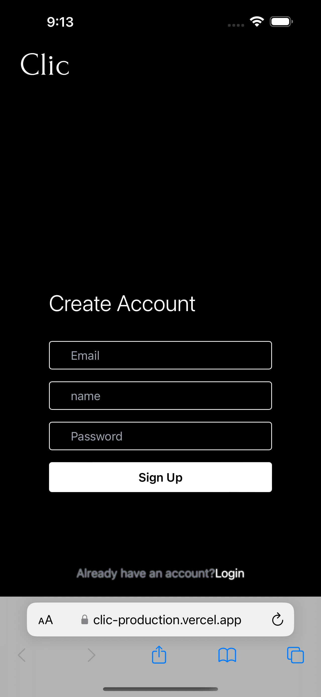
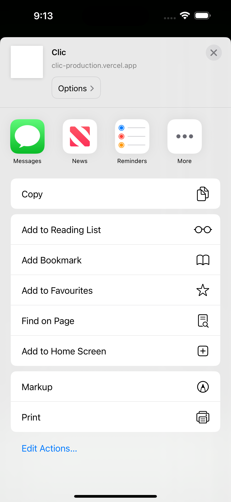
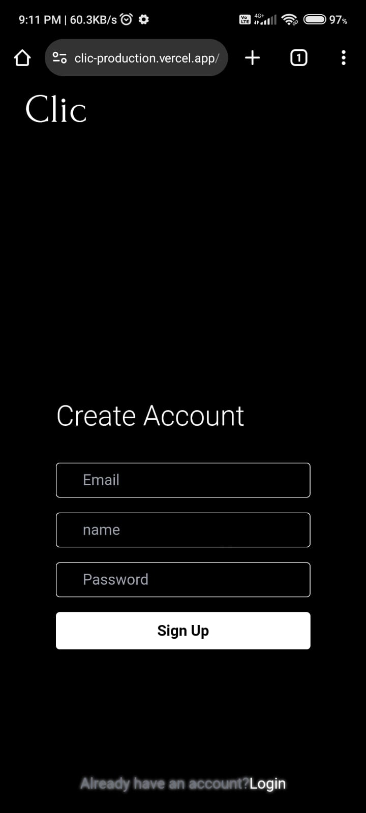
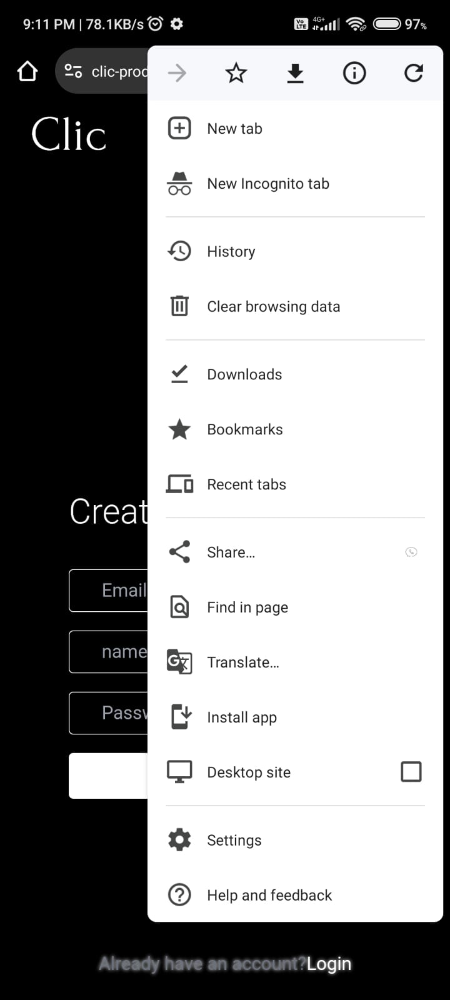

# Clic

## Description

Clic is a Progressive Web Application inspired by Instagram, empowering users to:

* **Create accounts:** Sign up seamlessly to join the Clic community.
* **Post captivating pictures:** Share your unique moments, stories, and expressions through visually stunning images.
* **Connect and follow:** Discover and build connections with like-minded individuals by following their profiles and posts.
* **Explore and engage:** Stay up-to-date with your network's updates, explore diverse content, and actively participate through likes, comments, and other interactive features.

 

> [!WARNING]
> This is not the development code.This is kind of similar code I am using for development. 

## How to Install Clic

To add Clic to your home screen, follow these steps based on your device:

### For iPhone

1. Open Safari and visit [Clic](https://clic-production.vercel.app).
2. Tap the "Share" button located at the bottom center of the screen.
3. Scroll down and select "Add to Home Screen."

 
   
   
   

### For Android

1. Open Chrome or your preferred browser and navigate to [Clic](https://clic-production.vercel.app).
2. Tap the three dots in the upper-right corner to open the menu.
3. If the "Install app" option is not immediately visible, try refreshing the page. It should then display the "Add to Home Screen" option.
4. Click on "Install app" once the option becomes available.

   
 
   
   
   
